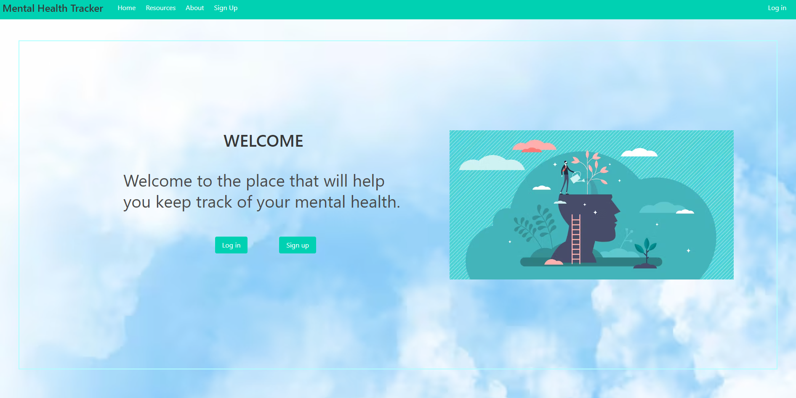
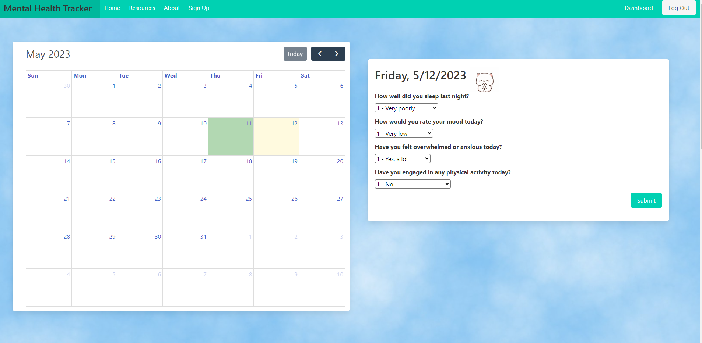
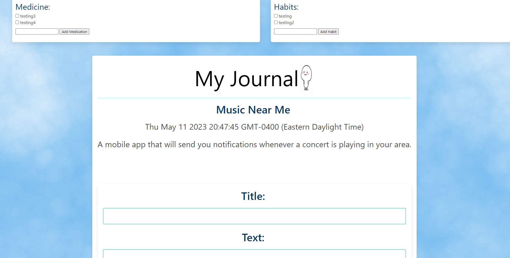
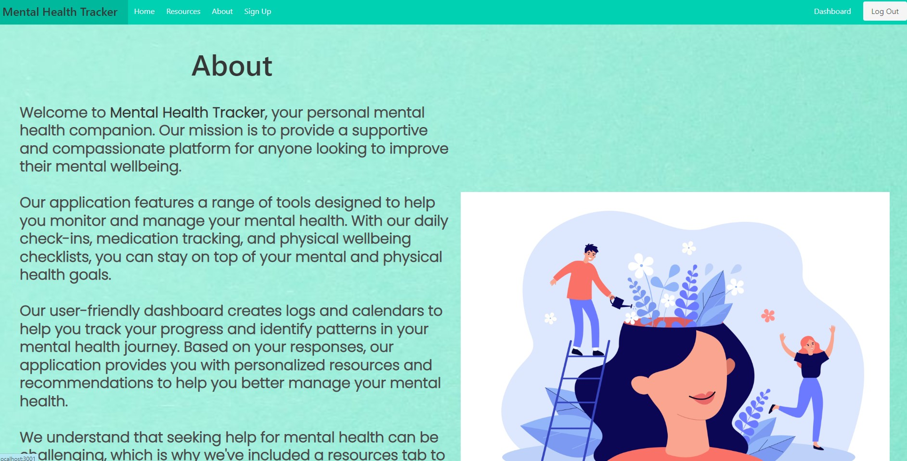

# Mental-Health-Tracker-

## Description

This project helps the user track their mental health with medication intake tracker, inspirational quotes, a calendar to track good days and bad days, input journal entries, and links to several helpline websites and call information. Mental health tracker is a great way to help the user in many different ways and aims to decrease negative effects on oneself. So many people suffer from some sort of mental health problems and not many feel like they have the information needed to get the help they need, or have a way to try to control the problems they have. Hopefully this application will help users maintain a healthy mind.

## Table of Contents

- [Installation](#installation)
- [Usage](#usage)

## Installation

To use this application correctly, you will need to install Node.js and then run NPM i to install bcrypt, connect-session-sequelize, dotenv, express, express-handlebars, express-session, mysql2, sequelize, and uuid.

## Usage

This application will provide the user with the ability to keep track of their mental health better, and easily access the necessary help they need so they don't feel like they are alone.

